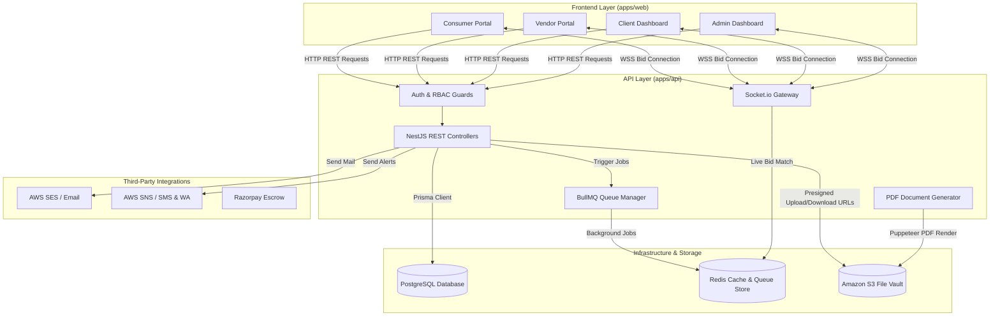
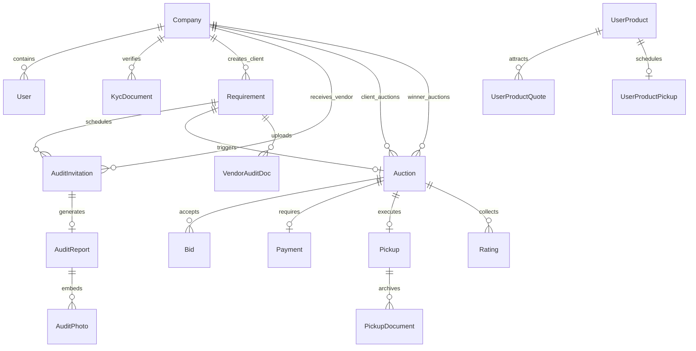
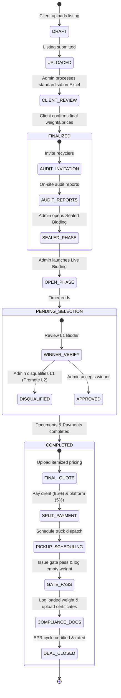
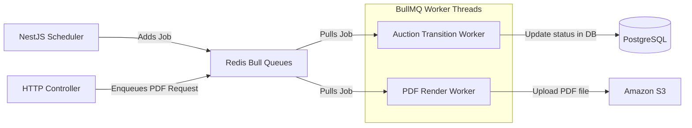
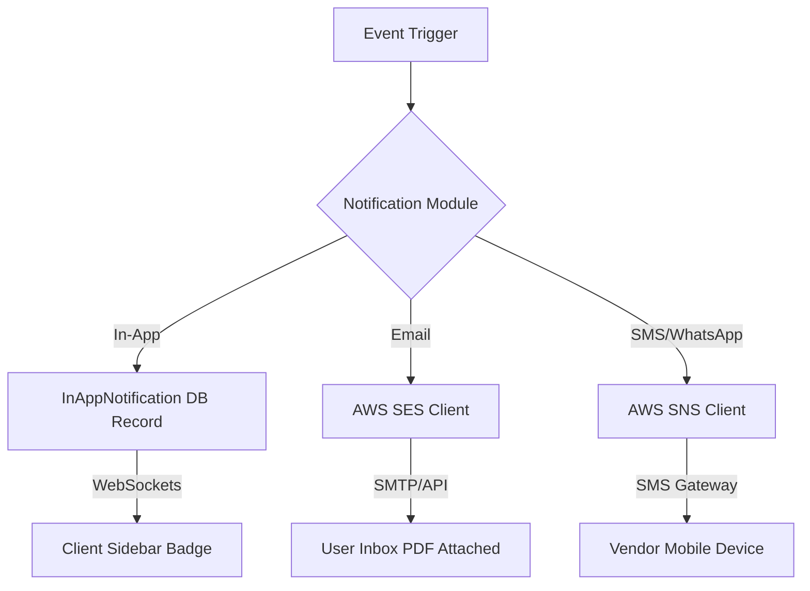

# 🏗️ WeConnect (EcoLoop) — Master Technical Architecture & System Flow

Welcome to the comprehensive technical architecture and end-to-end system flow documentation for **WeConnect** (internally code-named **EcoLoop**). 

WeConnect is an enterprise-grade B2B e-waste aggregator and reverse auction platform designed to streamline electronic waste recycling. It connects corporate waste generators (Clients), CPCB-authorized recycling units (Vendors), and individual citizens (Consumers) under a unified, legally compliant disposal pipeline supervised by system operators (Admins).

---

## 📌 Table of Contents
1. [System Topology & High-Level Architecture](#1-system-topology--high-level-architecture)
2. [Comprehensive Technology Stack](#2-comprehensive-technology-stack)
3. [Domain Models & Relational Schema (Prisma)](#3-domain-models--relational-schema-prisma)
4. [Master Pipeline & State Transitions](#4-master-pipeline--state-transitions)
5. [Step-by-Step Functional Modules](#5-step-by-step-functional-modules)
   - [Onboarding & KYC Verification](#onboarding--kyc-verification)
   - [Lot Posting & Standardisation](#lot-posting--standardisation)
   - [Audit Flow & Site Assessments](#audit-flow--site-assessments)
   - [Sealed Bid Phase](#sealed-bid-phase)
   - [Live Reverse Auction & Anti-Sniping Engine](#live-reverse-auction--anti-sniping-engine)
   - [Winner Selection & Disqualification Workflow](#winner-selection--disqualification-workflow)
   - [Document Generation Engine](#document-generation-engine)
   - [Split Payment Settlement (95/5 Commission)](#split-payment-settlement-955-commission)
   - [Pickup Logistics & Gate Pass Manifests](#pickup-logistics--gate-pass-manifests)
   - [Weight Reconciliation & EPR Closing](#weight-reconciliation--epr-closing)
   - [Consumer (B2C) Small-Scrap Lifecycle](#consumer-b2c-small-scrap-lifecycle)
6. [Real-Time Socket Architecture](#6-real-time-socket-architecture)
7. [Background Job Automation (Bull Queue)](#7-background-job-automation-bull-queue)
8. [Notification & Communication Channels](#8-notification--communication-channels)
9. [Project Directory Layout](#9-project-directory-layout)
10. [REST API Endpoint Inventory](#10-rest-api-endpoint-inventory)
11. [Data Isolation & Security Design](#11-data-isolation--security-design)

---

## 1. System Topology & High-Level Architecture

WeConnect is designed as a secure, high-performance monorepo separated into a Next.js App Router frontend and a NestJS REST & WebSocket API backend, utilizing PostgreSQL for persistence and Redis/BullMQ for asynchronous pipelines.



---

## 2. Comprehensive Technology Stack

### Core Layers
| Layer | Framework/Technology | Purpose | Key Library / Core Features |
|---|---|---|---|
| **Frontend** | Next.js 16.2.4 (App Router) | Responsive Single Page App | React 19, Turbopack, App Router |
| **Backend** | NestJS 11.0.1 | Enterprise-grade REST & WebSocket API | Controllers, Services, Pipes, Guards |
| **Database** | PostgreSQL | Relational transactional persistence | Structured ACID-compliant schemas |
| **Cache/Queue** | Redis & ioredis | In-memory storage, WebSocket pub-sub, queue | Rate limiting, live bidding cache, Bull MQ |
| **Storage** | Amazon S3 | Document vault & file storage | KYC docs, final POs, Form 6 PDFs |

### Key Libraries & Tooling
* **ORM:** Prisma Client v6.19.3 / v7.8.0 (Engine Type: Binary).
* **Real-time Engine:** `@nestjs/platform-socket.io` & `socket.io-client` v4.8.3.
* **Document Processor:** `puppeteer` v24.42.0 (headless PDF generation), `ejs` v5.0.2 (HTML templating), `archiver` v7.0.1.
* **Security & Auth:** `passport` & `passport-jwt` v4.0.1, `bcryptjs` v3.0.3.
* **Styling & UI:** Vanilla CSS custom property tokens, TailwindCSS v4, `framer-motion` v12.38.0.
* **Visualisations:** `recharts` v3.8.1 (Admin/Client/Vendor analytical dashboards).
* **Icons:** `material-symbols` v0.44.6.

---

## 3. Domain Models & Relational Schema (Prisma)

The database schema is organized into logical sub-schemas under `apps/api/prisma/schema/` to separate functional domains.

```
apps/api/prisma/schema/
├── config.prisma         # Generator settings, datasource, global enums
├── users.prisma          # User login credentials, Company profiles, KYC docs
├── requirements.prisma   # E-Waste listing requirements, site audits, invitations
├── auctions.prisma       # Auction phases, bids, active reverse war rooms
├── post-auction.prisma   # Payments, logistics pickups, certificates, ratings
├── notifications.prisma  # In-app notifications logs
└── user-products.prisma  # Consumer (B2C) small waste product listings & quotes
```

### Core Schema Visual Relationship Map



---

## 4. Master Pipeline & State Transitions

An e-waste lot moves through strict business gates controlled by backend state guards and cron validation:



---

## 5. Step-by-Step Functional Modules

### Onboarding & KYC Verification
* **Multi-Role Entry:** Users sign up as **Client** (corporate waste generator), **Vendor** (CPCB-authorized recycler), or **Consumer** (individual citizen).
* **4-Step KYC Wizard:** Organizations complete profile details $\rightarrow$ upload license certificates $\rightarrow$ submit banking details $\rightarrow$ review.
* **Required Documentation:**
  * **Clients:** GST Certificate, Company PAN, Certificate of Incorporation.
  * **Vendors (Recyclers):** GST, CPCB/SPCB Hazardous Waste Authorization, EPR License, Factory License.
* **Administrative Audit:** Admins review PDFs in a KYC queue, either approving the vendor (enabling marketplace access) or blocking/requesting edits with comments.

### Lot Posting & Standardisation
* **Lot Creation:** Corporate Clients upload their scrap lot description, location, estimated weight, photo attachments, and a raw Excel/CSV inventory list.
* **Lot Status:** Set to `UPLOADED`.
* **Standardisation Pipe:** Admins process the unstructured file, uploading the standard inventory template (`processedS3Key`).
* **Client Validation:** The listing transitions to `CLIENT_REVIEW`. The Client reviews the standard item list, sets the target price, and clicks "Confirm" to move it to `FINALIZED`.

### Audit Flow & Site Assessments
* **Audit Invitations:** To prevent bids on incorrect materials, the Admin invites qualified local Vendors to schedule site audits.
* **SPOC Sharing:** Once a Vendor accepts the audit, Single Point of Contact (SPOC) names and phone numbers are exchanged automatically.
* **Geotagged Assessment:** The Vendor's field auditor visits the site, verifies the inventory matches the listing, captures geotagged photos (`AUDIT_GEO_PHOTO`), and logs matches or discrepancies.
* **Report Upload:** Vendor uploads an Audit Report (Word/Excel) detailing the match percentage. The Admin reviews and checks `auditApprovedVendorIds` to enable bidding permissions.

### Sealed Bid Phase
* **Deposit Escrow (EMD):** To prevent frivolous bids, vendors must submit proof of Earnest Money Deposit (EMD) to unlock bidding.
* **Blind Submissions:** Vendors submit their blind base bid amount and upload a detailed unit-wise price sheet.
* **Information Lock:** Bids are sealed. Vendors can only see their own bid; clients and competitors have no access to the leaderboard.
* **Admin Review:** Once the window closes, the Admin reviews the bid list, compares rate sheets, and shortlists candidates to join the live room.

### Live Reverse Auction & Anti-Sniping Engine
* **Initial Pricing:** The highest bid from the Sealed Phase becomes the starting price of the Live Open Auction.
* **Tick Size Control:** Bidders must increase their bids by increments equal to or greater than the configurable `tickSize` (e.g., ₹5,000) and within a `maxTicks` limit.
* **Anti-Sniping (Auto-Extension):** If a bid is submitted in the last 3 minutes (configurable via `extensionMinutes`), the auction timer is extended by 3 minutes. This can occur up to 24 times (`maxTicks`), ensuring active bidders have time to counter.
* **Dynamic Visualization:** Sockets stream updates directly to client screens, showing:
  * Dynamic line charts (`recharts`) tracking price trends.
  * Current Leaderboard (L1, L2, L3) with vendor names masked as "Bidder X" to prevent collusion.
  * Bid history stream with live logs.

### Winner Selection & Disqualification Workflow
* **Winner Check:** When the timer hits zero, the auction moves to `PENDING_SELECTION`. The Admin has two options:
  1. **Approve Winner:** Accepts L1, locking the deal.
  2. **Disqualify L1 Winner:** If the winner defaults, refuses to coordinate, or fails to meet criteria, the Admin can disqualify them.
* **Disqualification Steps:**
  * **Leaderboard Confirmation:** The Admin sees the bid list with the current winner marked in red (`DISQUALIFIED`) and the next highest unique bidder highlighted in green (`NEW WINNER`).
  * **Sanction Enforcement:** The Admin inputs a mandatory reason and an optional fine/penalty amount. This blocks the disqualified company's profile until resolved.
  * **Automatic Promotion:** The backend updates `winnerId` to the next highest bidder and triggers the `selectWinner` flow, notifying all parties immediately.

### Document Generation Engine
* Upon winner approval, the system triggers the NestJS `DocumentsService` to compile legal documents using `EJS` HTML templates and render them into PDFs via `puppeteer`:
  * **Purchase Order (PO):** Lists material details, GST, and terms.
  * **Work Order (WO):** Formally authorizes scrap collection.
  * **Recycling Agreement:** Tri-party terms (Client, Recycler, WeConnect).
  * **Tax Invoice:** Generated post-pickup with actual weights.
* Generated PDFs are uploaded to AWS S3, and download links are emailed to the Client and Vendor.

### Split Payment Settlement (95/5 Commission)
* **Escrow Calculation:** The system calculates a 5% platform fee (commission) on the final winning bid.
* **Payment Instructions:** The Vendor is shown a split payment breakdown:
  * **95% of amount:** Payable directly to the Client's bank details.
  * **5% of amount:** Payable to WeConnect's bank account.
* **UTR Verification:** The Vendor uploads transaction reference numbers (UTR) and screenshot proofs for both transfers.
* **Admin Release:** The Admin verifies the transactions and releases the lot for pickup.

### Pickup Logistics & Gate Pass Manifests
* **Pickup Logistics:** The Recycler schedules a pickup date and logs vehicle details (license plate, driver name, phone number, and driver ID).
* **Gate Pass Issuance:** The Client reviews and issues a digital **Gate Pass**, authorizing the vehicle to enter the warehouse.
* **Weight Slip - Empty:** Upon arrival at the client site, the empty truck's weight is measured and recorded, and the Empty Weight Slip is uploaded.

### Weight Reconciliation & EPR Closing
* **Weight Slip - Loaded:** After loading the scrap, the truck is weighed again, and the Loaded Weight Slip is uploaded.
* **Reconciliation:** The system calculates the net waste weight. If the actual weight differs from the estimate, the final quote amount is adjusted proportionally.
* **Compliance Manifests:** The Vendor uploads regulatory compliance documents:
  * **Form 6 (Hazardous Waste Manifest):** Logged with transboundary details.
  * **Recycling Certificate & Disposal Certificate:** Verifying safe processing.
* **EPR Validation:** The Admin verifies the compliance documents, closing the Extended Producer Responsibility (EPR) loop. The Client can then download the complete compliance package.

### Consumer (B2C) Small-Scrap Lifecycle
* **Individual Posting:** Citizens upload scrap details (laptop, mobile, fridge) with photos, conditions, and asking prices.
* **Lot Approval:** Admins verify and approve the consumer posting.
* **Recycler Offers:** Certified vendors browse consumer listings and submit purchase quotes.
* **Logistics Dispatch:** The consumer reviews quotes, accepts an offer, and schedules a pickup. The recycler dispatches a truck, completes the pickup, and uploads compliance logs.

---

## 6. Real-Time Socket Architecture

Real-time bid streaming and countdown synchronisation are powered by a NestJS WebSocket Gateway integrated with a Redis storage layer.

```
                   [ Vendor Web Browsers ]
                     │                 ▲
          places bid │ (WSS Socket)    │ updates leaderboard
                     ▼                 │
            ┌───────────────────┐      │
            │ AuctionsGateway   ├──────┘
            │ (NestJS Gateway)  │
            └─────────┬─────────┘
                      │
           verifies   │ check/set current highest
           bid value  ▼
            ┌───────────────────┐
            │   Redis Server    │ <--- Holds active timer & bids in RAM
            │ (Pub/Sub Broker)  │
            └─────────┬─────────┘
                      │
           flushes    │ every 10 seconds
           to disk    ▼
            ┌───────────────────┐
            │ PostgreSQL (DB)   │
            └───────────────────┘
```

### Event Names & Payloads
* `joinAuction(auctionId)`: Authenticates and registers client/vendor into the specific socket room.
* `placeBid(auctionId, amount)`: Recalls vendor authorization status and applies the tick-size rule.
* `bidAccepted`: Broadcasts the updated leaderboard, rank shifts, and countdown timer.
* `auctionClosed`: Signals the end of the auction and redirects vendors to the status screen.

---

## 7. Background Job Automation (Bull Queue)

Background automation uses NestJS Bull integration backed by Redis to manage time-sensitive operations and resource-heavy processing.



### Core Queues
* **`auction-transitioner` (Cron Job):**
  * Runs every minute.
  * Checks scheduled startup times, moving lots from `UPCOMING` to `SEALED_PHASE`.
  * Closes sealed phases and launches `OPEN_PHASE`.
  * Monitors countdown timers and handles extensions.
* **`pdf-generation`:**
  * Offloads Puppeteer PDF rendering to background worker threads.
  * Handles retry logic for network or S3 upload failures.

---

## 8. Notification & Communication Channels

The notification framework delivers updates to all roles:



### Key Communications
* **Onboarding & KYC:** Sends registration receipts, KYC approval updates, or rejection details.
* **Auctions:** Notifies vendors of auction invitations, upcoming live rooms, outbid alerts, and winner selection.
* **Compliance & Logistics:** Sends gate pass confirmations, pickup schedules, weight discrepancies, and recycling certificate releases.
* **In-App Alerts:** Feeds directly into user sidebars, showing unread badge counts that clear as notifications are viewed.

---

## 9. Project Directory Layout

The monorepo structure divides concerns clearly between the Next.js web application and the NestJS API application.

```text
ecoloop-app/
├── apps/
│   ├── api/                               # ── NESTJS BACKEND API ──
│   │   ├── prisma/
│   │   │   ├── schema/                    # Domain-separated database sub-schemas
│   │   │   └── seed.ts                    # Development database seeder
│   │   ├── src/
│   │   │   ├── app.module.ts              # Global imports & bootstrap declarations
│   │   │   ├── main.ts                    # API initialization & CORS configuration
│   │   │   ├── auctions/                  # Auction management, bidding & disqualification
│   │   │   ├── audits/                    # On-site audit invitations & report validation
│   │   │   ├── auth/                      # JWT strategy, password hashing & guards
│   │   │   ├── companies/                 # Company profiles & KYC review
│   │   │   ├── dashboard/                 # Analytics & revenue reporting
│   │   │   ├── documents/                 # PDF generation templates
│   │   │   ├── notifications/             # Notification service
│   │   │   ├── payments/                  # Split payment confirmation
│   │   │   ├── pickups/                   # Weight records, logistics scheduling
│   │   │   ├── queue/                     # BullMQ jobs configurations
│   │   │   ├── ratings/                   # User ratings & feedback
│   │   │   ├── s3/                        # AWS S3 integration
│   │   │   ├── user-products/             # Consumer B2C operations
│   │   │   └── users/                     # Profile management
│   │   └── tsconfig.json
│   │
│   └── web/                               # ── NEXT.JS WEB CLIENT ──
│       ├── public/                        # Static assets (logos, images)
│       ├── src/
│       │   ├── app/                       # Page routes
│       │   │   ├── globals.css            # Custom design tokens, dark mode variables
│       │   │   ├── layout.tsx             # Root Layout wrapping AppContext providers
│       │   │   ├── page.tsx               # Landing page
│       │   │   ├── admin/                 # Admin dashboards
│       │   │   ├── client/                # Client dashboards
│       │   │   ├── vendor/                # Recycler dashboards
│       │   │   ├── consumer/              # B2C dashboards
│       │   │   └── onboarding/            # KYC wizard pages
│       │   ├── components/                # Shared UI & charts
│       │   ├── context/
│       │   │   └── AppContext.tsx         # Shared state provider
│       │   ├── types/
│       │   │   └── index.ts               # TypeScript types
│       │   └── utils/
│       └── tailwind.config.js
│
├── package.json
└── README.md
```

---

## 10. REST API Endpoint Inventory

All endpoints are prefixed with `/api` and secured with JWT strategy guards and Role-based authorization policies:

### 🔐 Authentication & Onboarding
* `POST /auth/register` - Creates a new user profile.
* `POST /auth/login` - Authenticates credentials and returns a JWT.
* `POST /onboarding/kyc` - Submits company documents to the S3 secure bucket.
* `POST /auth/verify-otp` - Verifies multi-factor OTP codes.

### 🏢 Companies (Admin Operations)
* `GET /companies/pending` - Lists company registrations awaiting review.
* `PATCH /companies/:id/status` - Approves or rejects company KYC profiles.
* `POST /companies/:id/lock` - Locks or blocks a company profile.

### 📝 Requirements & Listing Management
* `POST /requirements` - Client posts a new requirement Excel.
* `PATCH /requirements/:id/process` - Admin uploads the standardized requirements list.
* `PATCH /requirements/:id/confirm` - Client confirms final weights/prices.

### 🔍 Site Audits
* `POST /audits/invite` - Admin invites vendors to schedule audits.
* `PATCH /audits/:id/schedule` - Vendor schedules the site audit.
* `POST /audits/:id/report` - Vendor uploads the site audit report.
* `PATCH /audits/:id/approve` - Admin approves the audit report.

### ⚡ Reverse Auctions
* `GET /auctions` - Lists active auctions.
* `POST /auctions/:id/bid` - Submits a bid (checks phase & tick-size rules).
* `PATCH /auctions/:id/disqualify-winner` - Disqualifies the current winner and elevates the next bidder.
* `POST /auctions/:id/approve-winner` - Approves the winner, triggering document generation.

### 🚚 Logistics & Compliance
* `POST /payments/:id/proof` - Recycler uploads payment UTR and receipt.
* `PATCH /payments/:id/verify` - Admin confirms receipt of payment.
* `POST /pickups/:id/gate-pass` - Client issues the gate pass.
* `POST /pickups/:id/weight-slip` - Recycler uploads empty or loaded weight slips.
* `POST /pickups/:id/compliance` - Recycler uploads Form 6/disposal certificates.

---

## 11. Data Isolation & Security Design

WeConnect implements strict data isolation policies to ensure platform security, regulatory compliance, and fair bidding:

* **Collusion Prevention (Bid Masking):** During the Sealed and Live Bidding phases, vendor identities are masked on the leaderboard. Vendors cannot see who they are bidding against, preventing price-fixing and cartel formation.
* **Role-Based Access Control (RBAC):** Every API endpoint is secured with NestJS guards (`RolesGuard`). Users attempting to access endpoints outside their role are blocked.
* **Data Isolation:** Clients can only access listings, bids, and contracts associated with their organization. Vendors are limited to their bidding history, audit invitations, and logistics records.
* **Secure S3 Document Delivery:** Sensitive company documents (PAN, GST, PCB authorization certificates) are stored in a private S3 bucket. Access is restricted via temporary, time-limited Amazon S3 Presigned URLs that expire after 10 minutes.
* **Comprehensive Audit Trail:** Key database tables log user actions, IP addresses, and timestamps, ensuring a clean history of KYC approvals, bid submissions, payments, and compliance checks.

---
*Document Version 2.1 (Technical Architecture Master Specification). Designed for the Engineering Team.*
